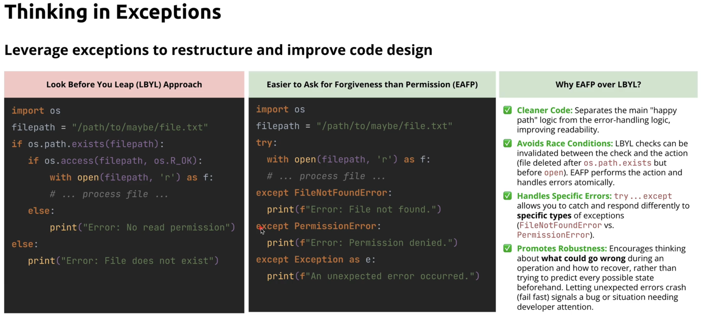

# Error Handling and Context Managers

### The `try` block

Contains code that might raise an exception.

### The `except` block

Allows handling individual exceptions. The best practice is to be specific about the exception we catch. Only use generic `except Exception` unless absolutely necessary, as it can hide unexpected bugs.

- It is possible to stack mulitple `except` blocks, so that different execeptions are handled.
- It is possible to catch multiple types: `except (FileNotFoundError, PermissionError)`
- It is possible to access the exception object with: `except Exception as e:`

### The `else` block

Contains code that will be executed if and only if the code within the `try` block executes successfully.

### The `finally` block

Contains the code that will be executed regardless of whether exceptions were raised. Recommended place for cleanup logic.

