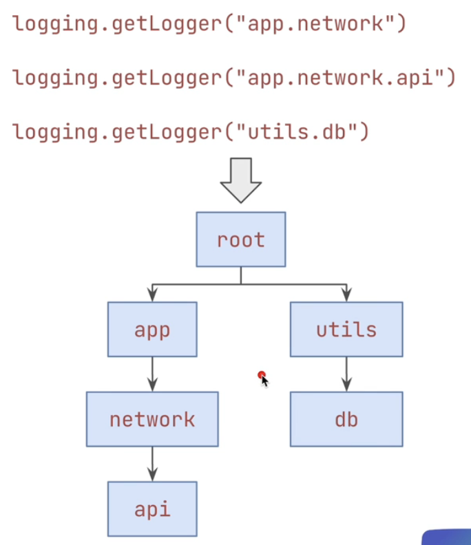
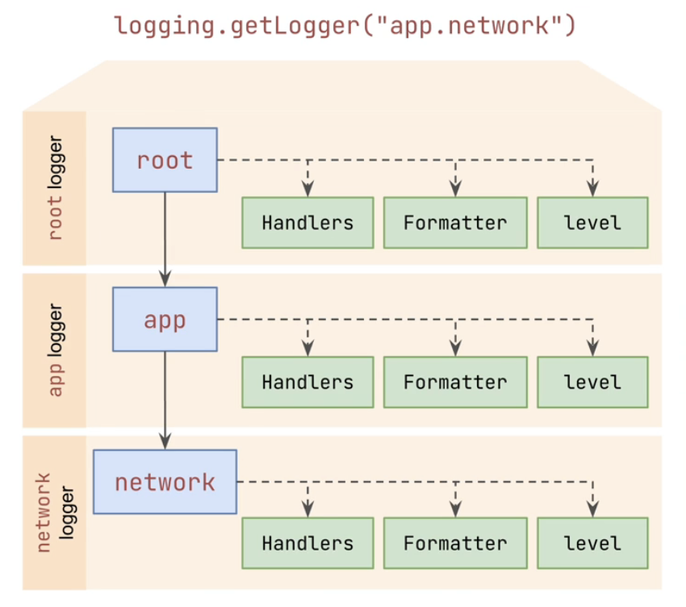
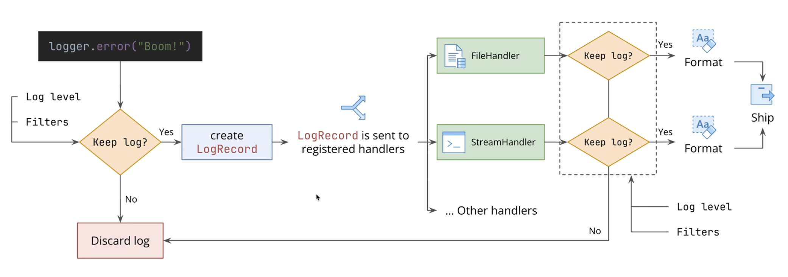

# Logging

Act of recording **events**, **messages** and **data** about the execution of our application or system. These records create a history of:

- What happended
- When it happended
- Why it happended

## Why is logging essential for DevOps?

1. **Troubleshooting and Debugging**

   When something goes wrong (_error, crash, unexpected behavior_), logs are one of the main source for understanding the sequence of events leading up to the failure.

2. **Auditing and Security**

   Logs can provide and audit trail of significant actions (_user logins, configuration changes, deployment triggers_). This is vital for auditing, security analysis and compliance requirements.

3. **Monitoring and Alerting**

   Logs can act as basis for metrics, trends, and alerts based on patterns or thresholds. This provides real-time insight into system health.

4. **Understanding System Behaviour**

   Logs provide visibility into how different components of a distributed system are interacting, which requests are being processed, and the general flow of execution, even when things are working correctly.

## Logging vs `print()`

While `print()` is fine for quick, temporary debugging during development, it's insufficient for robust application logging.

1. **Lack of Levels**

   All `print`s look the same. Logging uses levels (`DEBUG`,`INFO`,`WARNING`,`ERROR`,`CRITICAL`) to categorize message severity allowing filtering. E.g., scenario when we need to shift through thousands of print messages versus filtering for just `ERROR` logs.

2. **Missing Context**

   Logs automatically add valuable context: _timestamp_, _source file_, _function name_, _process ID_. Adding this manually to `print` is tedious and inconsistent.

3. **Infexible Outputs**

   `print` goes to stdout. Logging can easily direct output to files, rotate logs, send over network, and handle multiple destinations without code changes.

4. **No Structure**

   `print` outputs unstructured text. Logging supports structured formats (like _JSON_) easily consumed by analysis tools (_Logstash_, _Splunk_, _DataDog_ etc.),

## Think ahead and log relevant information

- **Anticipate Failures:**

  - Ask yourself: "What information is needed if this function fails?"
  - Log relevant inputs or state before potential failure points.

- **Record Milestones:**

  - Log key events or state changes (_Service started_, _Configuration loaded_, _Deployment initialted_).

- **Use Levels Wisely:**

  - `DEBUG`: Detailed info for diagnosing problems (might be turned off in production).
  - `INFO`: Confirmation of normal operation, signficant events (_Service started_, _Configuration loaded_ etc.).
  - `WARNING`: Indicate potential issues or unexpected situations that don't stop execution yet.
  - `ERROR`: Problems preventing a specific operation from completing.
  - `CRITICAL`: Severe errors like causing application termination.

- **Structure for Machines:**
  - Consider how logs will be parsed later (consistent formatting, key-value pairs, JSON).

## Logging Anatomy

- `logging.getLogger(<logger-name>)` retrieves a specific logger by name. A **logger** is an entrypoint that can be used by our scripts to send logs.

  

  - `<logger-name>` can use dots to define **hierarchy**. Loggers form a tree structure based on names. E.g. `myApp.network` is a child of `myApp`, which is a child of `root`.

- Loggers can have one or more **handlers**.

  

  - Handlers are responsible for formatting the logs and shipping them to their final destination.
  - We can have multiple handlers that process the same log message but deliver it in different formats to different destinations.
  - **Formatters** are attached to handlers.

- Both **loggers** and **handlers** retain and discard log messages based on level or more advanced **Filters**.

- By default, (`logger.propagate = True`), messages processed by **logger** are passed to its **parent's handlers**.

### Logging Flow: from logging something to shipping it to destinations

Let's assume, we have an Error and we want to log the Error.

1. Looger decides whether to keep the log based on the defined configuration such as **log level**, **filters** etc.

2. If "No", the message is discarded. If "Yes", the `LogRecord` is created and sent to all registered handlers (_FileHandler_, _StreamHandler_).

3. Once the message reaches the handlers, the handlers decide whether to keep the log again. Each handlers might keep message based on the defined configurations such as **log levels**, **filters** etc. such as FileHandler may only keep `ERROR` logs, StreamHandler may only keep `DEBUG`, `INFO`, `WARNING` logs.

4. If "No", the message is discarded. If "Yes", the log is formatted using the formatter and then shipped to destinations.
